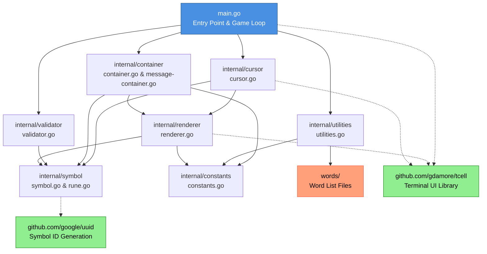

# terminal-hack

Development: Main development completed with intermittent improvements

## Description

This is a terminal based game written in Go, which is inspired by terminal hacking in Fallout 3. In this game, a 2d grid is filled with single 'dud' characters and words. The objective is to determine which word is the winning word in a limited number of guesses. Each incorrect guess will tell you how many of the selected letters are correct. A letter is correct if it has the same index and actual character as in the winning word. For example. if the winning word is `book` and selected word is `bang`, the selected word has one correct character.

Running this inside of `cool-retro-term` is suggested because it looks sick. Just search `cool-retro-term` on github, download the latest relase, build this from source, then run this in the new terminal.

Below is a run in `cool-retro-term`:

## Design

This game is created with a very low-level drawing library called Termbox. Because of this, I had to program all navigation/animation functionaliy.

## Architecture

### Package Responsibilities

| Package | File(s) | Purpose |
|---------|---------|---------|
| **main** | `main.go` | Entry point, initializes screen, runs game loop, handles events |
| **cursor** | `cursor.go` | Manages player cursor, navigation, and selection |
| **container** | `container.go` `message-container.go` | UI layout management, symbol grid storage, message display |
| **validator** | `validator.go` | Game logic, validates guesses, determines win/lose conditions |
| **renderer** | `renderer.go` | Low-level drawing functions for UI elements |
| **symbol** | `symbol.go` `rune.go` | Data structures for characters and words |
| **utilities** | `utilities.go` | Word loading, random generation, hex offset formatting |
| **constants** | `constants.go` | Configuration values, colors, styles, game settings |

### Data Flow

1. **Initialization**: `main.go` creates tcell screen and loads configuration
2. **Word Loading**: `utilities` loads word lists from `words/` directory
3. **Setup**: `container` creates UI containers and populates with symbols
4. **Game Logic**: `validator` randomly selects winning word
5. **Input Loop**: `cursor` handles user navigation via keyboard
6. **Rendering**: `renderer` draws all elements to screen
7. **Validation**: User presses Enter → `validator` checks guess → result displayed
8. **Loop**: Game continues until win, lose, or exit

## Authors

-   Matt Maloney : matttm

## Contribute

If you want to contribute, just send me a message.
